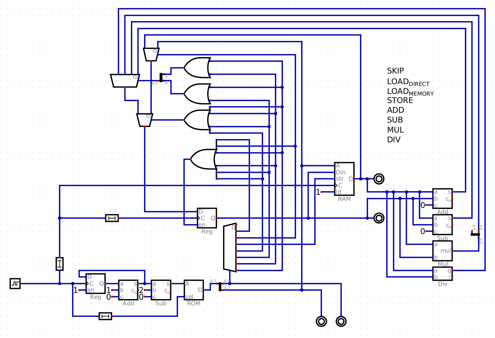

# BadPuter

*Very tiny, shitty cpu*

---

First computer/processing unit I've ever built, made with very minimal instructions / tutorials. Most of this was made just by figuring out how Digital works

Full of workarounds / bad design

---

### Quick info:
- Store/load info to RAM from register
- Load into register
- Perform basic math operations
- 8bit programs: 3bit instruction + 5bit data/address

---

### A basic application would look like this:
00010 001 <- Load 2 into register

10000 011 <- Store loaded value 2 into RAM address 10000

00011 001 <- Load 3 into register

10000 100 <- Perform addition of 2 (stored in RAM adress 10000) and 3 (stored in register)

^ Register should now have the value 5 !

---

### Plans for future:
- Break down RAM apart
- Figure out how arithmetics work
- Find a way to make this work without delays

Will be remade properly